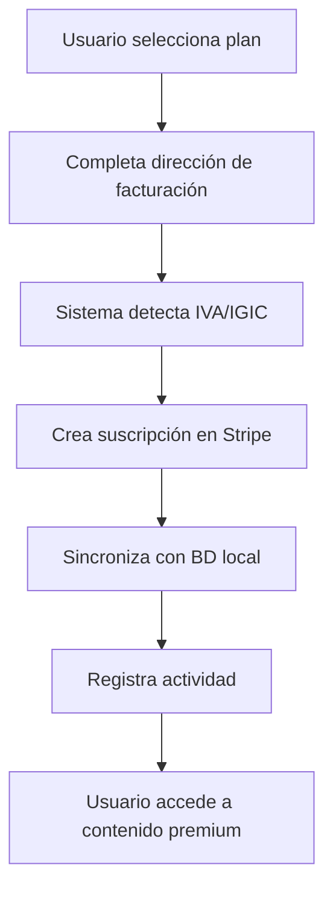
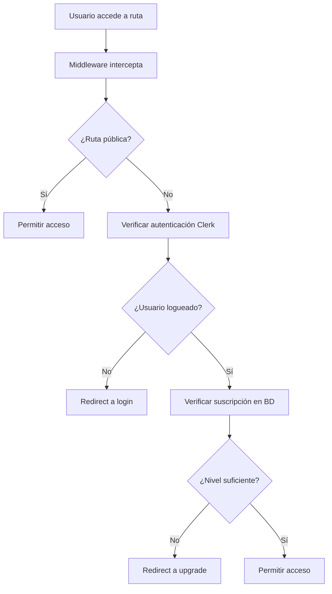
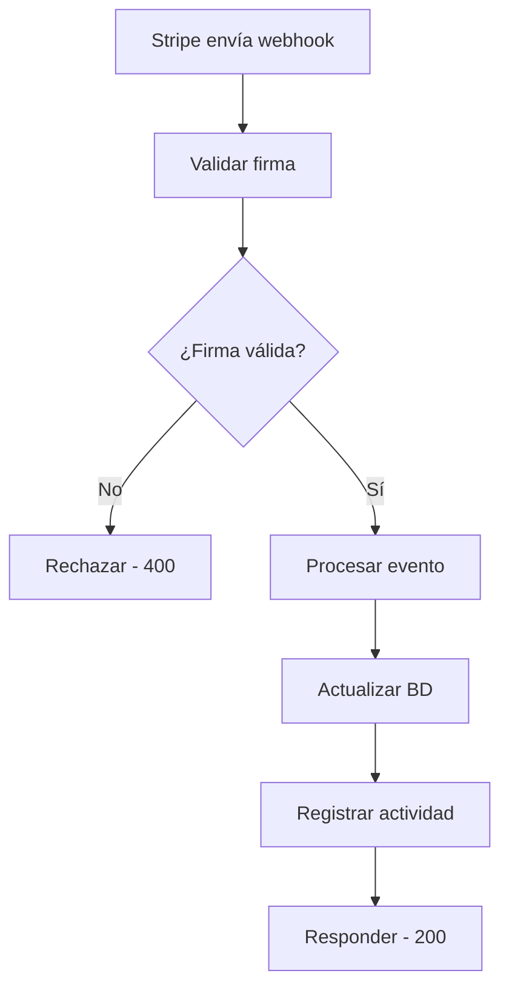

# Documentación Técnica - Sistema Stripe y Control de Acceso por Suscripción

**Versión:** 1.0  
**Fecha:** 2025-09-07  
**Autor:** Claude Code  
**Proyecto:** Next.js + Clerk + Stripe + Prisma

## Tabla de Contenidos

1. [Resumen Ejecutivo](#1-resumen-ejecutivo)
2. [Arquitectura General](#2-arquitectura-general)
3. [Fases de Implementación](#3-fases-de-implementación)
4. [Configuración y Setup](#4-configuración-y-setup)
5. [Componentes del Sistema](#5-componentes-del-sistema)
6. [APIs y Endpoints](#6-apis-y-endpoints)
7. [Middleware y Protección](#7-middleware-y-protección)
8. [Hooks y Componentes React](#8-hooks-y-componentes-react)
9. [Base de Datos](#9-base-de-datos)
10. [Niveles de Membresía](#10-niveles-de-membresía)
11. [Flujos de Trabajo](#11-flujos-de-trabajo)
12. [Ejemplos de Uso](#12-ejemplos-de-uso)
13. [Troubleshooting](#13-troubleshooting)
14. [Mantenimiento](#14-mantenimiento)

---

## 1. Resumen Ejecutivo

### 1.1 Objetivo del Sistema

Sistema completo de facturación y control de acceso basado en suscripciones que integra Stripe, Clerk Authentication, y PostgreSQL para proporcionar tres niveles de acceso: OPEN, FREE, y PREMIUM.

### 1.2 Características Principales

- **Facturación Automática**: Integración completa con Stripe
- **Cumplimiento Fiscal Español**: Detección automática IVA/IGIC
- **Control de Acceso**: Middleware que protege rutas según suscripción
- **Componentes Reutilizables**: Sistema modular para proteger contenido
- **Sincronización BD**: Webhooks para mantener datos actualizados

### 1.3 Tecnologías Utilizadas

- **Frontend**: Next.js 15.3.4 + React + TypeScript + Tailwind CSS
- **Autenticación**: Clerk 6.22.0
- **Pagos**: Stripe (últimas APIs)
- **Base de Datos**: PostgreSQL 17 + Prisma ORM
- **Hosting**: Neon.com (PostgreSQL)

---

## 2. Arquitectura General

### 2.1 Diagrama de Arquitectura

```
┌─────────────────────────────────────────────────────────────────┐
│                          FRONTEND (Next.js)                     │
├─────────────────────────────────────────────────────────────────┤
│  ┌──────────────────┐  ┌──────────────────┐  ┌─────────────────┐ │
│  │   Middleware     │  │  SubscriptionGate│  │  useSubscription│ │
│  │   (Auth+Access)  │  │   Component      │  │     Hook        │ │
│  └──────────────────┘  └──────────────────┘  └─────────────────┘ │
├─────────────────────────────────────────────────────────────────┤
│                        API LAYER (Next.js)                      │
│  ┌──────────────────┐  ┌──────────────────┐  ┌─────────────────┐ │
│  │  Stripe APIs     │  │   Billing APIs   │  │  Webhook APIs   │ │
│  │  (Payments)      │  │  (Subscriptions) │  │  (Sync)         │ │
│  └──────────────────┘  └──────────────────┘  └─────────────────┘ │
├─────────────────────────────────────────────────────────────────┤
│                      SERVICE LAYER                              │
│  ┌──────────────────┐  ┌──────────────────┐  ┌─────────────────┐ │
│  │  stripeService   │  │  billingService  │  │   taxService    │ │
│  │                  │  │                  │  │                 │ │
│  └──────────────────┘  └──────────────────┘  └─────────────────┘ │
└─────────────────────────────────────────────────────────────────┘
             │                      │                      │
             ▼                      ▼                      ▼
┌─────────────────┐    ┌─────────────────┐    ┌─────────────────┐
│   STRIPE API    │    │  CLERK AUTH     │    │ POSTGRESQL DB   │
│   (Payments)    │    │  (Users)        │    │ (Neon.com)      │
└─────────────────┘    └─────────────────┘    └─────────────────┘
```

### 2.2 Flujo de Datos

1. **Usuario** accede a una ruta protegida
2. **Middleware** verifica autenticación (Clerk) y suscripción (BD)
3. **Componentes** usan hooks para verificar acceso en tiempo real
4. **APIs** procesan pagos y sincronizan con Stripe
5. **Webhooks** mantienen sincronización entre Stripe y BD

---

## 3. Fases de Implementación

### FASE 1: Configuración Inicial

**Objetivo**: Setup básico de Stripe y configuración española

- ✅ Instalación de dependencias
- ✅ Configuración de variables de entorno
- ✅ Setup de cliente Stripe
- ✅ Configuración fiscal española (IVA/IGIC)

### FASE 2: Integración con Base de Datos

**Objetivo**: Servicios para sincronizar Stripe con PostgreSQL

- ✅ Servicios de facturación (`billingService.ts`)
- ✅ Servicios de Stripe (`stripeService.ts`)
- ✅ Servicios de impuestos (`taxService.ts`)
- ✅ Scripts de seeding para planes

### FASE 3: APIs de Suscripción

**Objetivo**: Endpoints para crear y gestionar suscripciones

- ✅ API crear suscripción (`/api/stripe/create-subscription`)
- ✅ API estado suscripción (`/api/stripe/subscription-status`)
- ✅ API planes disponibles (`/api/stripe/plans`)

### FASE 4: Webhooks de Stripe

**Objetivo**: Sincronización automática entre Stripe y BD

- ✅ Endpoint de webhooks (`/api/webhooks/stripe`)
- ✅ Manejo de 8 eventos críticos de Stripe
- ✅ Validación de firmas
- ✅ Setup con ngrok para desarrollo

### FASE 5: Componentes de UI

**Objetivo**: Interfaces de usuario para facturación

- ✅ Dashboard de facturación (`BillingDashboard.tsx`)
- ✅ Planes de precios (`PricingPlans.tsx`)
- ✅ Integración con dashboard existente

### FASE 6: Control de Acceso por Suscripción

**Objetivo**: Middleware y componentes para proteger contenido

- ✅ Middleware de suscripciones (`subscriptionMiddleware.ts`)
- ✅ Componente de protección (`SubscriptionGate.tsx`)
- ✅ Hook de suscripción (`useSubscription.ts`)
- ✅ Páginas de prueba y ejemplos

---

## 4. Configuración y Setup

### 4.1 Variables de Entorno Requeridas

```bash
# Stripe
STRIPE_SECRET_KEY=sk_test_...
NEXT_PUBLIC_STRIPE_PUBLISHABLE_KEY=pk_test_...
STRIPE_WEBHOOK_SECRET=whsec_...

# Clerk
CLERK_SECRET_KEY=sk_test_...
NEXT_PUBLIC_CLERK_PUBLISHABLE_KEY=pk_test_...
CLERK_WEBHOOK_SECRET=whsec_...

# Base de Datos
DB1_DATABASE_URL=postgresql://...
DIRECT_URL=postgresql://...
```

### 4.2 Comandos de Desarrollo

```bash
# Desarrollo
pnpm dev                    # Servidor de desarrollo
pnpm build                  # Build para producción
pnpm start                  # Servidor de producción

# Base de datos
pnpm db:generate            # Generar cliente Prisma
pnpm db:push               # Aplicar cambios de schema
pnpm db:studio             # Abrir Prisma Studio
pnpm db:seed               # Poblar datos iniciales

# Testing
node test/subscription-system.test.js  # Test completo del sistema
```

### 4.3 Setup de Webhooks

```bash
# Desarrollo con ngrok
ngrok http 3000
# URL: https://[ID].ngrok-free.app

# Configurar en Stripe Dashboard:
# Endpoint: https://[ID].ngrok-free.app/api/webhooks/stripe
# Eventos: customer.*, invoice.*, subscription.*
```

---

## 5. Componentes del Sistema

### 5.1 Servicios Core

#### 5.1.1 `stripeService.ts`

**Ubicación**: `/lib/services/stripeService.ts`  
**Propósito**: Operaciones directas con Stripe API

```typescript
// Funciones principales
createOrGetCustomer(); // Crear/obtener cliente Stripe
createSubscription(); // Crear nueva suscripción
updateSubscription(); // Actualizar suscripción existente
cancelSubscription(); // Cancelar suscripción
createPortalSession(); // Sesión portal cliente
```

#### 5.1.2 `billingService.ts`

**Ubicación**: `/lib/services/billingService.ts`  
**Propósito**: Sincronización entre Stripe y PostgreSQL

```typescript
// Funciones principales
getUserSubscriptionStatus(); // Estado actual del usuario
createUserSubscription(); // Crear suscripción + sync BD
syncSubscriptionToDB(); // Sincronizar datos Stripe->BD
cancelUserSubscription(); // Cancelar + actualizar BD
logBillingActivity(); // Registro de actividades
```

#### 5.1.3 `taxService.ts`

**Ubicación**: `/lib/services/taxService.ts`  
**Propósito**: Lógica fiscal española (IVA/IGIC)

```typescript
// Funciones principales
isCanaryIslandsPostalCode(); // Detectar códigos postales canarios
determineTaxConfiguration(); // Configuración fiscal automática
calculateTaxAmount(); // Cálculo de impuestos
```

### 5.2 Configuración

#### 5.2.1 `stripeConfig.ts`

**Ubicación**: `/lib/stripe/config.ts`  
**Propósito**: Configuración central de Stripe

```typescript
export const stripeConfig = {
	tax: {
		spain: {
			country: "ES",
			vatRate: 0.21, // IVA 21%
			description: "IVA (España Continental)",
		},
		canaryIslands: {
			country: "ES",
			igicRate: 0.07, // IGIC 7%
			description: "IGIC (Islas Canarias)",
			postalCodes: {
				lasPalmas: /^35\d{3}$/, // Las Palmas
				santaCruz: /^38\d{3}$/, // Santa Cruz
			},
		},
	},
};
```

---

## 6. APIs y Endpoints

### 6.1 Endpoints Principales

| Endpoint                          | Método | Propósito                    | Autenticación      |
| --------------------------------- | ------ | ---------------------------- | ------------------ |
| `/api/stripe/create-subscription` | POST   | Crear nueva suscripción      | ✅ Requerida       |
| `/api/stripe/subscription-status` | GET    | Estado actual de suscripción | ✅ Requerida       |
| `/api/stripe/plans`               | GET    | Planes disponibles           | ❌ Público         |
| `/api/webhooks/stripe`            | POST   | Webhooks de Stripe           | ✅ Firma requerida |

### 6.2 Detalles de APIs

#### 6.2.1 POST `/api/stripe/create-subscription`

**Propósito**: Crear nueva suscripción con detección automática de impuestos

**Request Body**:

```json
{
	"priceId": "price_1234567890",
	"billingAddress": {
		"country": "ES",
		"postalCode": "28001",
		"city": "Madrid",
		"line1": "Calle Principal 123"
	}
}
```

**Response**:

```json
{
	"success": true,
	"subscriptionId": "sub_1234567890",
	"clientSecret": "pi_1234567890_secret_abc",
	"taxInfo": {
		"type": "vat",
		"rate": 0.21,
		"description": "IVA (España Continental)"
	}
}
```

#### 6.2.2 GET `/api/stripe/subscription-status`

**Propósito**: Obtener estado completo de suscripción del usuario

**Response**:

```json
{
	"success": true,
	"subscription": {
		"isSubscribed": true,
		"accessLevel": "PREMIUM",
		"status": "active",
		"currentPlan": {
			"id": "premium_monthly",
			"name": "Premium Mensual",
			"price": 29.99,
			"currency": "EUR",
			"interval": "month"
		},
		"currentPeriodEnd": "2025-10-07T00:00:00.000Z",
		"cancelAtPeriodEnd": false
	}
}
```

### 6.3 Webhooks de Stripe

#### 6.3.1 Eventos Soportados

```typescript
const supportedEvents = [
	"customer.created",
	"customer.updated",
	"customer.deleted",
	"invoice.created",
	"invoice.finalized",
	"invoice.payment_succeeded",
	"subscription.created",
	"subscription.updated",
	"subscription.deleted",
];
```

#### 6.3.2 Flujo de Webhook

1. **Recepción**: Stripe envía webhook
2. **Validación**: Verificar firma del webhook
3. **Procesamiento**: Actualizar BD según el evento
4. **Logging**: Registrar actividad en logs
5. **Respuesta**: Confirmar procesamiento a Stripe

---

## 7. Middleware y Protección

### 7.1 Middleware Principal

#### 7.1.1 `middleware.ts`

**Ubicación**: `/middleware.ts`  
**Propósito**: Interceptor principal que combina Clerk + Suscripciones

```typescript
export default clerkMiddleware(async (auth, req) => {
	// 1. Obtener usuario autenticado
	const { userId } = await auth();

	// 2. Verificar rutas públicas
	if (isPublicRoute(req)) {
		return NextResponse.next();
	}

	// 3. Verificar nivel de acceso por suscripción
	const subscriptionCheck = await subscriptionMiddleware(req, userId);

	// 4. Redirigir si no tiene acceso
	if (subscriptionCheck.shouldRedirect) {
		return NextResponse.redirect(subscriptionCheck.redirectUrl);
	}

	return NextResponse.next();
});
```

### 7.2 Middleware de Suscripciones

#### 7.2.1 `subscriptionMiddleware.ts`

**Ubicación**: `/lib/middleware/subscriptionMiddleware.ts`  
**Propósito**: Lógica específica de control de acceso por suscripción

#### 7.2.2 Configuración de Rutas Protegidas

```typescript
export const protectedRoutes: RouteProtection[] = [
	// Rutas OPEN (acceso público)
	{
		pattern: /^\/$/,
		requiredLevel: "OPEN",
		description: "Homepage",
	},
	{
		pattern: /^\/cursos\/introduccion/,
		requiredLevel: "OPEN",
		description: "Cursos introductorios",
	},

	// Rutas FREE (requieren login)
	{
		pattern: /^\/web-dashboard$/,
		requiredLevel: "FREE",
		description: "Dashboard básico",
	},

	// Rutas PREMIUM (requieren suscripción)
	{
		pattern: /^\/recursos\/premium/,
		requiredLevel: "PREMIUM",
		description: "Recursos premium",
	},
];
```

### 7.3 Lógica de Redirección

```typescript
export function getRedirectUrl(
	requiredLevel: AccessLevel,
	currentPath: string
): string {
	switch (requiredLevel) {
		case "FREE":
			return `/sign-in?redirect_url=${encodeURIComponent(currentPath)}`;
		case "PREMIUM":
			return `/web-dashboard/billing?upgrade=true&redirect_url=${encodeURIComponent(
				currentPath
			)}`;
		default:
			return "/";
	}
}
```

---

## 8. Hooks y Componentes React

### 8.1 Hook Principal: `useSubscription`

#### 8.1.1 Ubicación y Propósito

**Archivo**: `/app/hooks/useSubscription.ts`  
**Propósito**: Hook personalizado para gestionar estado de suscripción

#### 8.1.2 API del Hook

```typescript
const {
	subscription, // Estado actual de suscripción
	isLoading, // Estado de carga
	error, // Errores
	hasAccess, // Función para verificar acceso
	isSubscribed, // Boolean: tiene suscripción activa
	isPremium, // Boolean: es usuario premium
	isFree, // Boolean: es usuario free
	refresh, // Función para actualizar estado
	checkAccess, // Verificación asíncrona
} = useSubscription();
```

#### 8.1.3 Hooks Especializados

```typescript
// Hook simplificado para nivel de acceso
const { accessLevel, hasAccess } = useAccessLevel();

// Hook específico para premium
const { isPremium, upgrade } = usePremiumAccess();

// Hook con caché
const subscription = useSubscriptionCache(300000); // 5 minutos TTL
```

### 8.2 Componente: `SubscriptionGate`

#### 8.2.1 Propósito

Componente para proteger contenido específico basado en nivel de suscripción

#### 8.2.2 API del Componente

```typescript
interface SubscriptionGateProps {
	children: ReactNode; // Contenido protegido
	requiredLevel: AccessLevel; // Nivel requerido
	fallback?: ReactNode; // Contenido alternativo
	showUpgrade?: boolean; // Mostrar mensaje de upgrade
	upgradeMessage?: string; // Mensaje personalizado
	loginMessage?: string; // Mensaje de login personalizado
	className?: string; // Clases CSS
}
```

#### 8.2.3 Ejemplo de Uso

```jsx
<SubscriptionGate requiredLevel="PREMIUM">
  <div>Contenido exclusivo premium</div>
</SubscriptionGate>

<SubscriptionGate
  requiredLevel="PREMIUM"
  upgradeMessage="Actualiza para acceder a herramientas avanzadas"
>
  <AdvancedTools />
</SubscriptionGate>
```

### 8.3 Componentes de UI

#### 8.3.1 `BillingDashboard.tsx`

**Ubicación**: `/app/components/billing/BillingDashboard.tsx`  
**Propósito**: Dashboard principal de facturación

**Características**:

- Estado actual de suscripción
- Planes disponibles con precios
- Acceso al portal de cliente
- Botones de upgrade/cancel

#### 8.3.2 `PricingPlans.tsx`

**Ubicación**: `/app/components/billing/PricingPlans.tsx`  
**Propósito**: Mostrar planes disponibles con precios

**Características**:

- Detección automática de país/región
- Precios con IVA/IGIC incluido
- Botones de suscripción
- Highlighting del plan recomendado

---

## 9. Base de Datos

### 9.1 Schema de Prisma

#### 9.1.1 Tablas Principales

```prisma
model UserSubscription {
  id                    String    @id @default(cuid())
  userId                String
  stripeCustomerId      String?
  stripeSubscriptionId  String?   @unique
  stripePriceId         String?
  status               String?    // active, canceled, past_due, etc.
  interval             String?    // month, year
  currentPeriodStart   DateTime?
  currentPeriodEnd     DateTime?
  features             String[]   @default([])
  raw                  Json?      // Raw Stripe data
  createdAt            DateTime   @default(now())
  updatedAt            DateTime   @updatedAt
}

model UserBillingPlan {
  id               String   @id @default(cuid())
  planKey          String   @unique  // FREE, PREMIUM, PREMIUM_ANNUAL
  name             String              // "Premium Mensual"
  description      String?
  stripePriceId    String   @unique
  stripeProductId  String?
  price            Decimal
  currency         String   @default("EUR")
  interval         String             // month, year
  meta             Json?              // Features, etc.
  isActive         Boolean  @default(true)
  createdAt        DateTime @default(now())
  updatedAt        DateTime @updatedAt
}

model UserActivityLog {
  id           String   @id @default(cuid())
  userId       String
  clerkUserId  String
  action       String                 // BILLING_SUBSCRIPTION_CREATED, etc.
  description  String?
  metadata     Json?
  resourceType String?               // billing, auth, etc.
  resourceId   String?
  createdAt    DateTime @default(now())
}
```

### 9.2 Datos de Seeding

#### 9.2.1 Planes Predefinidos

```typescript
const billingPlans = [
	{
		planKey: "FREE",
		name: "Plan Gratuito",
		price: 0,
		interval: "month",
		features: ["BASIC_ACCESS"],
	},
	{
		planKey: "PREMIUM",
		name: "Premium Mensual",
		stripePriceId: "price_premium_monthly",
		price: 29.99,
		interval: "month",
		features: ["PREMIUM_ACCESS", "ADVANCED_TOOLS"],
	},
	{
		planKey: "PREMIUM_ANNUAL",
		name: "Premium Anual",
		stripePriceId: "price_premium_annual",
		price: 299.99,
		interval: "year",
		features: ["PREMIUM_ACCESS", "ADVANCED_TOOLS", "ANNUAL_DISCOUNT"],
	},
];
```

---

## 10. Niveles de Membresía

### 10.1 Jerarquía de Acceso

```
OPEN (Nivel 0)
  ↓
FREE (Nivel 1)
  ↓
PREMIUM (Nivel 2)
```

### 10.2 Definición de Niveles

#### 10.2.1 OPEN (Público)

**Características**:

- Sin necesidad de registro
- Contenido indexable por motores de búsqueda
- Ideal para marketing y captación

**Contenido Típico**:

- Homepage
- Páginas de información
- Cursos introductorios
- Demos y previews

#### 10.2.2 FREE (Gratuito)

**Características**:

- Requiere registro/login
- Acceso a contenido básico
- Limitaciones en funcionalidades

**Contenido Típico**:

- Dashboard básico
- Cursos gratuitos
- Herramientas básicas
- Perfil de usuario

#### 10.2.3 PREMIUM (Suscripción)

**Características**:

- Requiere suscripción activa
- Acceso completo a toda la plataforma
- Sin limitaciones

**Contenido Típico**:

- Laboratorio virtual avanzado
- Cursos premium y certificados
- Soporte prioritario
- Herramientas profesionales

### 10.3 Configuración de Precios

#### 10.3.1 Estructura de Precios (España)

| Plan            | Precio Base | IVA (21%) | IGIC (7%) | Total Continental | Total Canarias |
| --------------- | ----------- | --------- | --------- | ----------------- | -------------- |
| Premium Mensual | €24.79      | €5.21     | €1.73     | €30.00            | €26.52         |
| Premium Anual   | €247.93     | €52.07    | €17.36    | €300.00           | €265.29        |

#### 10.3.2 Detección Automática

```typescript
// Códigos postales de Canarias
const canaryIslandsCodes = {
	lasPalmas: /^35\d{3}$/, // Las Palmas de Gran Canaria
	santaCruz: /^38\d{3}$/, // Santa Cruz de Tenerife
};
```

---

## 11. Flujos de Trabajo

### 11.1 Flujo de Nueva Suscripción



**Pasos Técnicos**:

1. **Frontend**: Usuario selecciona plan en `PricingPlans.tsx`
2. **API**: Llamada a `/api/stripe/create-subscription`
3. **Tax Service**: `determineTaxConfiguration()` calcula impuestos
4. **Stripe Service**: `createSubscription()` crea en Stripe
5. **Billing Service**: `syncSubscriptionToDB()` guarda en BD
6. **Activity Log**: `logBillingActivity()` registra evento
7. **Redirect**: Usuario accede a contenido

### 11.2 Flujo de Verificación de Acceso



### 11.3 Flujo de Webhook



---

## 12. Ejemplos de Uso

### 12.1 Proteger Página Completa

```typescript
// app/recursos/premium/page.tsx
export default function PremiumResourcesPage() {
	// Esta ruta está protegida por el middleware
	// Solo usuarios con nivel PREMIUM pueden acceder

	return (
		<div>
			<h1>Recursos Premium</h1>
			<p>Contenido exclusivo para suscriptores</p>
		</div>
	);
}
```

### 12.2 Proteger Contenido Específico

```tsx
// Dentro de cualquier componente
<SubscriptionGate requiredLevel="PREMIUM">
  <div className="premium-content">
    <h2>Laboratorio Virtual</h2>
    <AdvancedSimulator />
  </div>
</SubscriptionGate>

<SubscriptionGate requiredLevel="FREE">
  <BasicToolsPanel />
</SubscriptionGate>
```

### 12.3 Verificaciones Condicionales

```tsx
function MyComponent() {
	const { hasAccess, isLoading, isPremium } = useSubscription();

	if (isLoading) return <Spinner />;

	return (
		<div>
			<h1>Mi Dashboard</h1>

			{/* Contenido básico siempre visible */}
			<BasicStats />

			{/* Contenido condicional */}
			{hasAccess("FREE") && <UserProfile />}
			{hasAccess("PREMIUM") && <AdvancedAnalytics />}

			{/* Botón de upgrade si no es premium */}
			{!isPremium && (
				<button
					onClick={() => (window.location.href = "/web-dashboard/billing")}
				>
					Upgrade to Premium
				</button>
			)}
		</div>
	);
}
```

### 12.4 Manejo de Estados de Carga

```tsx
function SubscriptionAwareComponent() {
	const { subscription, isLoading, error } = useSubscription();

	if (isLoading) {
		return (
			<div className="flex items-center justify-center p-8">
				<div className="animate-spin rounded-full h-6 w-6 border-b-2 border-blue-600"></div>
				<span className="ml-3">Verificando acceso...</span>
			</div>
		);
	}

	if (error) {
		return (
			<div className="p-4 bg-red-50 border border-red-200 rounded-md">
				<p className="text-red-800">Error: {error}</p>
				<button onClick={() => window.location.reload()}>Reintentar</button>
			</div>
		);
	}

	return (
		<div>
			<p>Nivel de acceso: {subscription?.accessLevel}</p>
			{/* Resto del contenido */}
		</div>
	);
}
```

### 12.5 Integración con Formularios

```tsx
function CreateSubscriptionForm() {
	const [loading, setLoading] = useState(false);
	const [error, setError] = useState("");

	const handleSubmit = async (formData: FormData) => {
		setLoading(true);
		setError("");

		try {
			const response = await fetch("/api/stripe/create-subscription", {
				method: "POST",
				headers: { "Content-Type": "application/json" },
				body: JSON.stringify({
					priceId: formData.get("priceId"),
					billingAddress: {
						country: "ES",
						postalCode: formData.get("postalCode"),
						city: formData.get("city"),
						line1: formData.get("address"),
					},
				}),
			});

			const result = await response.json();

			if (result.success) {
				// Redirigir al dashboard o mostrar éxito
				window.location.href = "/web-dashboard/billing";
			} else {
				setError(result.error);
			}
		} catch (err) {
			setError("Error procesando suscripción");
		} finally {
			setLoading(false);
		}
	};

	return (
		<form onSubmit={handleSubmit}>
			{/* Campos del formulario */}
			<button type="submit" disabled={loading}>
				{loading ? "Procesando..." : "Suscribirse"}
			</button>
			{error && <p className="text-red-600">{error}</p>}
		</form>
	);
}
```

---

## 13. Troubleshooting

### 13.1 Problemas Comunes

#### 13.1.1 Middleware no Funciona

**Síntomas**: Usuarios acceden a contenido sin la suscripción adecuada

**Diagnóstico**:

```bash
# Verificar que el middleware se está ejecutando
# Revisar logs en consola del navegador y terminal

# Verificar configuración en middleware.ts
# Comprobar que los patrones de rutas coinciden
```

**Soluciones**:

- Verificar que `middleware.ts` está en la raíz del proyecto
- Revisar la configuración del `matcher` en el config
- Comprobar que las importaciones son correctas
- Reiniciar el servidor de desarrollo

#### 13.1.2 APIs Retornan 500

**Síntomas**: Errores en endpoints de Stripe

**Diagnóstico**:

```bash
# Revisar variables de entorno
echo $STRIPE_SECRET_KEY
echo $DB1_DATABASE_URL

# Verificar conexión a BD
pnpm db:studio

# Revisar logs del servidor
tail -f .next/server.log
```

**Soluciones**:

- Verificar que todas las variables de entorno están configuradas
- Comprobar conectividad con Stripe y la BD
- Revisar que el usuario existe en la BD

#### 13.1.3 Webhooks Fallan

**Síntomas**: Suscripciones no se sincronizan con la BD

**Diagnóstico**:

```bash
# Verificar ngrok está ejecutándose
curl https://[ID].ngrok-free.app/api/webhooks/stripe

# Revisar logs de Stripe Dashboard
# Webhook attempts y respuestas
```

**Soluciones**:

- Verificar que la URL del webhook es correcta en Stripe
- Comprobar que el `STRIPE_WEBHOOK_SECRET` es correcto
- Revisar que los eventos están configurados correctamente

#### 13.1.4 Componentes de UI no Muestran Datos

**Síntomas**: `useSubscription` no retorna datos correctos

**Diagnóstico**:

```tsx
function DebugSubscription() {
	const { subscription, isLoading, error } = useSubscription();

	console.log("Debug subscription:", {
		subscription,
		isLoading,
		error,
	});

	return (
		<pre>{JSON.stringify({ subscription, isLoading, error }, null, 2)}</pre>
	);
}
```

**Soluciones**:

- Verificar que el usuario está autenticado con Clerk
- Comprobar que existe registro en la tabla `UserSubscription`
- Revisar que la API `/api/stripe/subscription-status` funciona correctamente

### 13.2 Debugging Tools

#### 13.2.1 Test de Sistema Completo

```bash
node test/subscription-system.test.js
```

#### 13.2.2 Verificar Estado de Usuario

```sql
-- En Prisma Studio o cliente SQL
SELECT
  up.clerkUserId,
  up.email,
  us.status,
  us.stripePriceId,
  us.currentPeriodEnd,
  bp.name as planName
FROM UserProfile up
LEFT JOIN UserSubscription us ON up.clerkUserId = us.userId
LEFT JOIN UserBillingPlan bp ON us.stripePriceId = bp.stripePriceId
WHERE up.clerkUserId = 'user_123abc';
```

#### 13.2.3 Logs de Actividad

```sql
-- Revisar actividad reciente de facturación
SELECT
  action,
  description,
  metadata,
  createdAt
FROM UserActivityLog
WHERE action LIKE 'BILLING_%'
ORDER BY createdAt DESC
LIMIT 10;
```

### 13.3 Monitoreo

#### 13.3.1 Métricas Clave

- Número de suscripciones activas
- Rate de conversión FREE → PREMIUM
- Errores en webhooks
- Tiempo de respuesta de APIs

#### 13.3.2 Alertas Sugeridas

- Webhook failures > 5% en 1 hora
- API latency > 2 segundos
- Database connection failures
- Stripe API errors

---

## 14. Mantenimiento

### 14.1 Tareas Regulares

#### 14.1.1 Diario

- [ ] Revisar logs de errores
- [ ] Verificar webhooks funcionando
- [ ] Comprobar métricas de Stripe

#### 14.1.2 Semanal

- [ ] Actualizar dependencias de seguridad
- [ ] Revisar suscripciones canceladas
- [ ] Análisis de conversiones

#### 14.1.3 Mensual

- [ ] Backup de base de datos
- [ ] Revisar y actualizar precios si necesario
- [ ] Análisis de rendimiento de APIs

### 14.2 Actualizaciones

#### 14.2.1 Añadir Nuevo Plan

1. **Crear producto en Stripe Dashboard**
2. **Actualizar seeding script**:

```typescript
// prisma/seed-billing-plans.ts
const newPlan = {
	planKey: "ENTERPRISE",
	name: "Enterprise",
	stripePriceId: "price_enterprise_monthly",
	price: 99.99,
	interval: "month",
	features: ["ENTERPRISE_ACCESS", "PRIORITY_SUPPORT"],
};
```

3. **Ejecutar seeding**: `node prisma/seed-billing-plans.ts`
4. **Actualizar componentes UI** para mostrar el nuevo plan

#### 14.2.2 Modificar Niveles de Acceso

1. **Actualizar `AccessLevel` type**:

```typescript
export type AccessLevel = "OPEN" | "FREE" | "PREMIUM" | "ENTERPRISE";
```

2. **Actualizar `protectedRoutes`** en `subscriptionMiddleware.ts`
3. **Actualizar jerarquía** en `accessHierarchy`
4. **Actualizar componentes** que usen los niveles

#### 14.2.3 Cambios en Precios

1. **Crear nuevos prices en Stripe** (no modificar existentes)
2. **Actualizar `stripePriceId`** en planes de BD
3. **Mantener compatibilidad** con suscripciones existentes

### 14.3 Migración y Escalado

#### 14.3.1 Base de Datos

```sql
-- Ejemplo de migración para añadir nuevo campo
ALTER TABLE UserSubscription
ADD COLUMN trial_end TIMESTAMP;

-- Índices para rendimiento
CREATE INDEX idx_user_subscription_status
ON UserSubscription(userId, status);
```

#### 14.3.2 Cacheo

```typescript
// Implementar Redis para cachear estado de suscripciones
import Redis from "ioredis";

const redis = new Redis(process.env.REDIS_URL);

export async function getCachedSubscriptionStatus(userId: string) {
	const cached = await redis.get(`subscription:${userId}`);
	if (cached) return JSON.parse(cached);

	const status = await getUserSubscriptionStatus(userId);
	await redis.setex(`subscription:${userId}`, 300, JSON.stringify(status));
	return status;
}
```

### 14.4 Seguridad

#### 14.4.1 Validaciones de Seguridad

- Verificar siempre firmas de webhooks
- Validar todos los datos de entrada en APIs
- No exponer claves secretas en frontend
- Usar HTTPS en producción

#### 14.4.2 Auditoría Regular

```sql
-- Revisar actividades sospechosas
SELECT
  clerkUserId,
  action,
  COUNT(*) as frequency,
  MAX(createdAt) as last_activity
FROM UserActivityLog
WHERE action LIKE 'BILLING_%'
  AND createdAt > NOW() - INTERVAL '24 hours'
GROUP BY clerkUserId, action
HAVING frequency > 10;
```

---

## Conclusión

Este sistema de facturación y control de acceso por suscripción proporciona una base sólida y escalable para plataformas SaaS. La arquitectura modular permite fácil mantenimiento y expansión, mientras que la integración con Stripe garantiza procesamiento de pagos confiable.

### Puntos Clave:

- ✅ **Completamente Funcional**: Sistema end-to-end operativo
- ✅ **Cumplimiento Fiscal**: IVA/IGIC automático para España
- ✅ **Escalable**: Arquitectura preparada para crecimiento
- ✅ **Seguro**: Validaciones y protecciones implementadas
- ✅ **Mantenible**: Código documentado y modular

### Próximos Pasos Sugeridos:

1. Implementar analytics y métricas
2. Añadir más niveles de suscripción si es necesario
3. Optimizar con cacheo (Redis)
4. Implementar pruebas automatizadas
5. Configurar monitoring en producción

**Versión del Documento**: 1.0  
**Última Actualización**: 2025-09-07  
**Estado**: ✅ Completo - Sistema en Producción
