# Migración a Payment Element + Address Element - Sistema Stripe Moderno

**Versión:** 2.0  
**Fecha:** 2025-09-08  
**Objetivo:** Migrar del sistema manual actual a integración moderna Payment Element + Address Element  
**Proyecto:** Next.js + Clerk + Stripe + Prisma  

---

## 1. Resumen Ejecutivo

### 1.1 Situación Actual vs Objetivo

| **Aspecto** | **Sistema Actual** | **Sistema Objetivo** |
|-------------|-------------------|---------------------|
| Captura Dirección | Formulario HTML manual | Address Element |
| Captura Pago | Sin captura de tarjeta | Payment Element |
| Impuestos | Cálculo manual con NaN errors | Stripe Tax + IGIC manual |
| Precios | Variables según TAX | **Fijos: €29 y €290 (tax incluido)** |
| Flujo | Modal → API custom | Stripe Checkout redirect |
| Países | Solo España | **Norteamérica + Sudamérica + UE** |

### 1.2 Requisitos Clave del Negocio

1. **Precios Fijos Globales**: €29 mensual, €290 anual (impuestos incluidos)
2. **Email Inmutable**: Email de Clerk no se puede cambiar en Stripe
3. **Detección IGIC**: Canarias usar IGIC 7% manual, resto automático
4. **Cobertura Geográfica**: Norteamérica, Sudamérica, Unión Europea
5. **Mobile-First**: Formulario optimizado para móvil
6. **Simplicidad**: Proceso de pago en máximo 3 pasos

---

## 2. Arquitectura de la Nueva Solución

### 2.1 Flujo del Cliente Objetivo

```mermaid
graph TD
    A[Cliente registrado con Clerk] --> B[Email almacenado en BD - Inmutable]
    B --> C[Cliente selecciona plan €29/€290]
    C --> D[Address Element: Captura dirección]
    D --> E{¿Código postal Canarias?}
    E -->|Sí| F[IGIC 7% manual]
    E -->|No| G[Stripe Tax automático]
    F --> H[Payment Element: Captura tarjeta]
    G --> H
    H --> I[Stripe procesa pago]
    I --> J[Webhook sincroniza BD]
    J --> K[Cliente accede contenido Premium]
```



### 2.2 Componentes Técnicos

```
┌─────────────────────────────────────────────────────────────┐
│                    FRONTEND MODERNO                         │
├─────────────────────────────────────────────────────────────┤
│  ┌─────────────────┐  ┌─────────────────┐  ┌──────────────┐ │
│  │ Address Element │  │ Payment Element │  │ Checkout     │ │
│  │ (Stripe)        │  │ (Stripe)        │  │ Redirect     │ │
│  └─────────────────┘  └─────────────────┘  └──────────────┘ │
├─────────────────────────────────────────────────────────────┤
│                     API LAYER                               │
│  ┌─────────────────┐  ┌─────────────────┐  ┌──────────────┐ │
│  │ PaymentIntent   │  │ Country Support │  │ Tax Detection│ │
│  │ API             │  │ API             │  │ Service      │ │
│  └─────────────────┘  └─────────────────┘  └──────────────┘ │
└─────────────────────────────────────────────────────────────┘
             │                      │                      │
             ▼                      ▼                      ▼
┌─────────────────┐    ┌─────────────────┐    ┌──────────────┐
│   STRIPE API    │    │  COUNTRY LIST   │    │ IGIC LOGIC   │
│   (Modern)      │    │  (3 Regions)    │    │ (Canarias)   │
└─────────────────┘    └─────────────────┘    └──────────────┘
```

---

## 3. Países y Regiones Soportadas

### 3.1 Lista de Países por Región

#### 3.1.1 Norteamérica
```typescript
const northAmerica = [
  { code: 'US', name: 'Estados Unidos', currency: 'USD' },
  { code: 'CA', name: 'Canadá', currency: 'CAD' },
  { code: 'MX', name: 'México', currency: 'MXN' }
];
```

#### 3.1.2 Sudamérica
```typescript
const southAmerica = [
  { code: 'AR', name: 'Argentina', currency: 'ARS' },
  { code: 'BR', name: 'Brasil', currency: 'BRL' },
  { code: 'CL', name: 'Chile', currency: 'CLP' },
  { code: 'CO', name: 'Colombia', currency: 'COP' },
  { code: 'PE', name: 'Perú', currency: 'PEN' },
  { code: 'UY', name: 'Uruguay', currency: 'UYU' }
];
```

#### 3.1.3 Unión Europea (Selección Principal)
```typescript
const europeanUnion = [
  { code: 'ES', name: 'España', currency: 'EUR', hasIGIC: true },
  { code: 'FR', name: 'Francia', currency: 'EUR' },
  { code: 'DE', name: 'Alemania', currency: 'EUR' },
  { code: 'IT', name: 'Italia', currency: 'EUR' },
  { code: 'PT', name: 'Portugal', currency: 'EUR' },
  { code: 'NL', name: 'Países Bajos', currency: 'EUR' },
  { code: 'BE', name: 'Bélgica', currency: 'EUR' },
  { code: 'AT', name: 'Austria', currency: 'EUR' },
  { code: 'IE', name: 'Irlanda', currency: 'EUR' },
  { code: 'PL', name: 'Polonia', currency: 'PLN' },
  { code: 'SE', name: 'Suecia', currency: 'SEK' },
  { code: 'DK', name: 'Dinamarca', currency: 'DKK' }
];
```

### 3.2 Configuración de Precios Fijos

```typescript
// lib/stripe/pricing-config.ts
export const fixedPricing = {
  // Precios FIJOS independientemente del país
  premium_monthly: {
    amount: 2900, // €29.00 (céntimos)
    currency: 'eur',
    displayPrice: '€29',
    includes_tax: true
  },
  premium_annual: {
    amount: 29000, // €290.00 (céntimos)  
    currency: 'eur',
    displayPrice: '€290',
    includes_tax: true
  }
};

// Tax configuration
export const taxConfig = {
  // España Continental - Stripe Tax automático
  spain_mainland: {
    use_stripe_tax: true,
    description: 'IVA incluido via Stripe Tax'
  },
  // Canarias - IGIC manual
  canary_islands: {
    use_stripe_tax: false,
    manual_tax_rate: 'txr_igic_canarias_7',
    description: 'IGIC 7% incluido'
  },
  // Resto del mundo - Stripe Tax
  international: {
    use_stripe_tax: true,
    description: 'Impuestos incluidos via Stripe Tax'
  }
};
```

---

## 4. Implementación Técnica

### 4.1 Nuevas Dependencias

```bash
# Instalar dependencias de Stripe modernas
pnpm add @stripe/stripe-js @stripe/react-stripe-js
pnpm add -D @types/stripe
```

### 4.2 Configuración Stripe Cliente

```typescript
// lib/stripe/client-config.ts
import { loadStripe } from '@stripe/stripe-js';

export const stripePromise = loadStripe(
  process.env.NEXT_PUBLIC_STRIPE_PUBLISHABLE_KEY!,
  {
    locale: 'es', // Localización española por defecto
    apiVersion: '2024-06-20',
  }
);

export const stripeElementsOptions = {
  appearance: {
    theme: 'stripe' as const,
    variables: {
      colorPrimary: '#0066cc',
      colorBackground: '#ffffff',
      colorText: '#30313d',
      colorDanger: '#df1b41',
      borderRadius: '8px'
    }
  },
  locale: 'es' as const
};
```

### 4.3 Componente Address Element

```typescript
// app/components/billing/ModernAddressElement.tsx
'use client';

import { AddressElement, useStripe } from '@stripe/react-stripe-js';
import { useState, useEffect } from 'react';
import { supportedCountries } from '@/lib/stripe/countries-config';
import { isCanaryIslandsPostalCode } from '@/lib/services/taxService';

interface ModernAddressElementProps {
  onAddressChange: (address: any, taxInfo: any) => void;
}

export function ModernAddressElement({ onAddressChange }: ModernAddressElementProps) {
  const stripe = useStripe();
  const [taxPreview, setTaxPreview] = useState(null);

  const handleAddressChange = async (event: any) => {
    if (event.complete) {
      const address = event.value;
      
      // Detectar configuración fiscal
      let taxInfo = { type: 'automatic', description: 'Impuestos incluidos' };
      
      if (address.country === 'ES' && address.postalCode) {
        if (isCanaryIslandsPostalCode(address.postalCode)) {
          taxInfo = {
            type: 'manual_igic',
            description: 'IGIC 7% incluido (Canarias)',
            rate: 0.07
          };
        } else {
          taxInfo = {
            type: 'automatic_vat',
            description: 'IVA incluido via Stripe Tax',
            rate: 0.21
          };
        }
      }
      
      setTaxPreview(taxInfo);
      onAddressChange(address, taxInfo);
    }
  };

  return (
    <div className="space-y-4">
      <AddressElement
        options={{
          mode: 'billing',
          allowedCountries: supportedCountries.map(c => c.code),
          blockPoBox: true,
          fields: {
            phone: 'never' // Simplificar formulario
          },
          validation: {
            phone: {
              required: 'never'
            }
          }
        }}
        onChange={handleAddressChange}
      />
      
      {/* Preview de impuestos */}
      {taxPreview && (
        <div className="p-3 bg-blue-50 rounded-lg border border-blue-200">
          <div className="flex items-center text-sm">
            <svg className="w-4 h-4 text-blue-500 mr-2" fill="currentColor" viewBox="0 0 20 20">
              <path fillRule="evenodd" d="M18 10a8 8 0 11-16 0 8 8 0 0116 0zm-7-4a1 1 0 11-2 0 1 1 0 012 0zM9 9a1 1 0 000 2v3a1 1 0 001 1h1a1 1 0 100-2v-3a1 1 0 00-1-1H9z" clipRule="evenodd" />
            </svg>
            <span className="text-blue-800">
              {taxPreview.description}
            </span>
          </div>
        </div>
      )}
    </div>
  );
}
```

### 4.4 Componente Payment Element

```typescript
// app/components/billing/ModernPaymentElement.tsx
'use client';

import { PaymentElement, useStripe, useElements } from '@stripe/react-stripe-js';
import { useState } from 'react';

interface ModernPaymentElementProps {
  clientSecret: string;
  onPaymentSuccess: () => void;
  onPaymentError: (error: string) => void;
}

export function ModernPaymentElement({ 
  clientSecret, 
  onPaymentSuccess, 
  onPaymentError 
}: ModernPaymentElementProps) {
  const stripe = useStripe();
  const elements = useElements();
  const [processing, setProcessing] = useState(false);

  const handleSubmit = async (event: React.FormEvent) => {
    event.preventDefault();
    
    if (!stripe || !elements || !clientSecret) {
      return;
    }

    setProcessing(true);

    try {
      const { error, paymentIntent } = await stripe.confirmPayment({
        elements,
        clientSecret,
        confirmParams: {
          return_url: `${window.location.origin}/web-dashboard/billing/success`
        }
      });

      if (error) {
        onPaymentError(error.message || 'Error procesando el pago');
      } else if (paymentIntent?.status === 'succeeded') {
        onPaymentSuccess();
      }
    } catch (err) {
      onPaymentError('Error inesperado en el pago');
    } finally {
      setProcessing(false);
    }
  };

  return (
    <form onSubmit={handleSubmit} className="space-y-6">
      <PaymentElement 
        options={{
          layout: 'tabs',
          paymentMethodOrder: ['card', 'paypal', 'apple_pay', 'google_pay']
        }}
      />
      
      <button
        type="submit"
        disabled={!stripe || processing}
        className="w-full bg-blue-600 hover:bg-blue-700 disabled:bg-gray-400 text-white font-medium py-3 px-4 rounded-lg transition-colors"
      >
        {processing ? 'Procesando...' : 'Confirmar Suscripción'}
      </button>
    </form>
  );
}
```

### 4.5 Modal de Suscripción Moderno

```typescript
// app/components/billing/ModernSubscriptionModal.tsx
'use client';

import { useState } from 'react';
import { Elements } from '@stripe/react-stripe-js';
import { stripePromise, stripeElementsOptions } from '@/lib/stripe/client-config';
import { ModernAddressElement } from './ModernAddressElement';
import { ModernPaymentElement } from './ModernPaymentElement';
import type { BillingPlan } from '@/lib/stripe/types';

interface ModernSubscriptionModalProps {
  isOpen: boolean;
  onClose: () => void;
  plan: BillingPlan;
  userEmail: string;
}

type Step = 'address' | 'payment' | 'processing';

export function ModernSubscriptionModal({
  isOpen,
  onClose,
  plan,
  userEmail
}: ModernSubscriptionModalProps) {
  const [step, setStep] = useState<Step>('address');
  const [billingAddress, setBillingAddress] = useState(null);
  const [taxInfo, setTaxInfo] = useState(null);
  const [clientSecret, setClientSecret] = useState('');
  const [error, setError] = useState('');

  const handleAddressComplete = (address: any, tax: any) => {
    setBillingAddress(address);
    setTaxInfo(tax);
  };

  const handleContinueToPayment = async () => {
    if (!billingAddress) return;

    try {
      setStep('processing');
      
      // Crear PaymentIntent con dirección y configuración fiscal
      const response = await fetch('/api/stripe/create-payment-intent', {
        method: 'POST',
        headers: { 'Content-Type': 'application/json' },
        body: JSON.stringify({
          priceId: plan.stripePriceId,
          email: userEmail, // Email inmutable de Clerk
          billingAddress,
          taxConfig: taxInfo
        })
      });

      const data = await response.json();
      
      if (data.success) {
        setClientSecret(data.clientSecret);
        setStep('payment');
      } else {
        setError(data.error);
        setStep('address');
      }
    } catch (err) {
      setError('Error creando el pago');
      setStep('address');
    }
  };

  const handlePaymentSuccess = () => {
    onClose();
    window.location.href = '/web-dashboard/billing/success';
  };

  const handlePaymentError = (errorMsg: string) => {
    setError(errorMsg);
    setStep('payment');
  };

  if (!isOpen) return null;

  return (
    <div className="fixed inset-0 z-50 overflow-y-auto">
      <div className="flex items-center justify-center min-h-screen px-4">
        <div className="fixed inset-0 bg-black bg-opacity-50" onClick={onClose} />
        
        <div className="relative bg-white rounded-xl shadow-xl max-w-lg w-full p-6">
          {/* Header */}
          <div className="flex items-center justify-between mb-6">
            <h2 className="text-xl font-semibold">
              Suscripción a {plan.name}
            </h2>
            <button onClick={onClose} className="text-gray-400 hover:text-gray-600">
              <svg className="w-6 h-6" fill="none" stroke="currentColor" viewBox="0 0 24 24">
                <path strokeLinecap="round" strokeLinejoin="round" strokeWidth={2} d="M6 18L18 6M6 6l12 12" />
              </svg>
            </button>
          </div>

          {/* Precio fijo prominente */}
          <div className="text-center mb-6 p-4 bg-gray-50 rounded-lg">
            <div className="text-2xl font-bold text-gray-900">
              {plan.interval === 'month' ? '€29' : '€290'}
              <span className="text-sm font-normal text-gray-600 ml-1">
                /{plan.interval === 'month' ? 'mes' : 'año'}
              </span>
            </div>
            <p className="text-sm text-gray-600">Impuestos incluidos</p>
          </div>

          {error && (
            <div className="mb-4 p-3 bg-red-50 border border-red-200 rounded-lg">
              <p className="text-red-700 text-sm">{error}</p>
            </div>
          )}

          {/* Contenido según paso */}
          {step === 'address' && (
            <Elements stripe={stripePromise} options={stripeElementsOptions}>
              <div className="space-y-4">
                <h3 className="font-medium">Dirección de facturación</h3>
                <ModernAddressElement onAddressChange={handleAddressComplete} />
                
                <button
                  onClick={handleContinueToPayment}
                  disabled={!billingAddress}
                  className="w-full bg-blue-600 hover:bg-blue-700 disabled:bg-gray-400 text-white font-medium py-3 px-4 rounded-lg transition-colors"
                >
                  Continuar al Pago
                </button>
              </div>
            </Elements>
          )}

          {step === 'payment' && clientSecret && (
            <Elements 
              stripe={stripePromise} 
              options={{
                ...stripeElementsOptions,
                clientSecret
              }}
            >
              <div className="space-y-4">
                <h3 className="font-medium">Información de pago</h3>
                <ModernPaymentElement
                  clientSecret={clientSecret}
                  onPaymentSuccess={handlePaymentSuccess}
                  onPaymentError={handlePaymentError}
                />
              </div>
            </Elements>
          )}

          {step === 'processing' && (
            <div className="text-center py-8">
              <div className="animate-spin rounded-full h-8 w-8 border-b-2 border-blue-600 mx-auto mb-4"></div>
              <p className="text-gray-600">Preparando el pago...</p>
            </div>
          )}
        </div>
      </div>
    </div>
  );
}
```

---

## 5. APIs Modernizadas

### 5.1 API Payment Intent

```typescript
// app/api/stripe/create-payment-intent/route.ts
import { NextRequest, NextResponse } from 'next/server';
import { auth } from '@clerk/nextjs/server';
import { stripe } from '@/lib/stripe/client';
import { determineTaxConfiguration } from '@/lib/services/taxService';
import { fixedPricing } from '@/lib/stripe/pricing-config';

export async function POST(req: NextRequest) {
  try {
    const { userId } = await auth();
    if (!userId) {
      return NextResponse.json({ error: 'Not authenticated' }, { status: 401 });
    }

    const { priceId, email, billingAddress, taxConfig } = await req.json();
    
    // Validar precio fijo
    const planAmount = priceId.includes('monthly') ? 2900 : 29000; // €29 o €290
    
    // Crear o obtener customer con email inmutable
    let customer;
    const existingCustomers = await stripe.customers.list({
      email,
      limit: 1
    });

    if (existingCustomers.data.length > 0) {
      customer = existingCustomers.data[0];
    } else {
      customer = await stripe.customers.create({
        email, // Email de Clerk - NO se puede cambiar
        metadata: {
          clerkUserId: userId,
          source: 'clerk_registration'
        },
        address: {
          country: billingAddress.country,
          postal_code: billingAddress.postal_code,
          city: billingAddress.city,
          line1: billingAddress.line1,
          line2: billingAddress.line2,
          state: billingAddress.state
        }
      });
    }

    // Configurar tax collection
    let automaticTax = { enabled: true };
    let metadata = {
      clerkUserId: userId,
      taxRegion: 'international',
      priceId: priceId
    };

    // Configuración especial para España/Canarias
    if (billingAddress.country === 'ES') {
      const taxInfo = determineTaxConfiguration({
        country: 'ES',
        postalCode: billingAddress.postal_code
      });

      if (taxInfo.isCanaryIslands) {
        // Canarias: usar Tax Rate manual para IGIC
        automaticTax = { enabled: false };
        metadata.taxRegion = 'canary_islands';
        metadata.taxType = 'manual_igic';
      } else {
        // España Continental: Stripe Tax automático
        metadata.taxRegion = 'spain_mainland';
        metadata.taxType = 'automatic_vat';
      }
    }

    // Crear PaymentIntent con precio fijo
    const paymentIntent = await stripe.paymentIntents.create({
      amount: planAmount,
      currency: 'eur',
      customer: customer.id,
      metadata,
      automatic_tax: automaticTax,
      setup_future_usage: 'off_session', // Para suscripciones futuras
      description: `Suscripción ${priceId.includes('monthly') ? 'mensual' : 'anual'} - ${email}`
    });

    // Aplicar Tax Rate manual para Canarias si es necesario
    if (billingAddress.country === 'ES' && taxConfig?.type === 'manual_igic') {
      // Aquí aplicarías el Tax Rate de IGIC si fuera necesario
      // Por ahora, el precio ya incluye todos los impuestos
    }

    return NextResponse.json({
      success: true,
      clientSecret: paymentIntent.client_secret,
      customerId: customer.id,
      paymentIntentId: paymentIntent.id
    });

  } catch (error) {
    console.error('Error creating PaymentIntent:', error);
    return NextResponse.json(
      { error: 'Error creando el pago' },
      { status: 500 }
    );
  }
}
```

### 5.2 API Countries Support

```typescript
// app/api/stripe/supported-countries/route.ts
import { NextResponse } from 'next/server';

const supportedCountries = [
  // Norteamérica
  { code: 'US', name: 'Estados Unidos', region: 'north_america', currency: 'USD' },
  { code: 'CA', name: 'Canadá', region: 'north_america', currency: 'CAD' },
  { code: 'MX', name: 'México', region: 'north_america', currency: 'MXN' },
  
  // Sudamérica
  { code: 'AR', name: 'Argentina', region: 'south_america', currency: 'ARS' },
  { code: 'BR', name: 'Brasil', region: 'south_america', currency: 'BRL' },
  { code: 'CL', name: 'Chile', region: 'south_america', currency: 'CLP' },
  { code: 'CO', name: 'Colombia', region: 'south_america', currency: 'COP' },
  { code: 'PE', name: 'Perú', region: 'south_america', currency: 'PEN' },
  { code: 'UY', name: 'Uruguay', region: 'south_america', currency: 'UYU' },
  
  // Unión Europea
  { code: 'ES', name: 'España', region: 'european_union', currency: 'EUR', hasIGIC: true },
  { code: 'FR', name: 'Francia', region: 'european_union', currency: 'EUR' },
  { code: 'DE', name: 'Alemania', region: 'european_union', currency: 'EUR' },
  { code: 'IT', name: 'Italia', region: 'european_union', currency: 'EUR' },
  { code: 'PT', name: 'Portugal', region: 'european_union', currency: 'EUR' },
  { code: 'NL', name: 'Países Bajos', region: 'european_union', currency: 'EUR' },
  { code: 'BE', name: 'Bélgica', region: 'european_union', currency: 'EUR' },
  { code: 'AT', name: 'Austria', region: 'european_union', currency: 'EUR' },
  { code: 'IE', name: 'Irlanda', region: 'european_union', currency: 'EUR' },
  { code: 'PL', name: 'Polonia', region: 'european_union', currency: 'PLN' },
  { code: 'SE', name: 'Suecia', region: 'european_union', currency: 'SEK' },
  { code: 'DK', name: 'Dinamarca', region: 'european_union', currency: 'DKK' }
];

export async function GET() {
  return NextResponse.json({
    success: true,
    countries: supportedCountries,
    regions: {
      north_america: supportedCountries.filter(c => c.region === 'north_america'),
      south_america: supportedCountries.filter(c => c.region === 'south_america'),
      european_union: supportedCountries.filter(c => c.region === 'european_union')
    }
  });
}
```

---

## 6. Configuraciones y Utilidades

### 6.1 Tax Service Mejorado

```typescript
// lib/services/taxService.ts - Actualización
import { stripeConfig } from '@/lib/stripe/config';

/**
 * Determina configuración fiscal para precios FIJOS
 * El precio siempre es el mismo, pero necesitamos saber cómo reportar a Stripe
 */
export function determineTaxConfiguration(address: {
  country: string;
  postalCode?: string;
}): CustomerTaxInfo {
  const { country, postalCode } = address;
  
  // España: Detectar Canarias para IGIC vs IVA
  if (country === 'ES' && postalCode) {
    const isCanaryIslands = isCanaryIslandsPostalCode(postalCode);
    
    if (isCanaryIslands) {
      return {
        country,
        postalCode,
        isCanaryIslands: true,
        region: 'canary_islands',
        taxConfig: {
          type: 'included_manual_igic',
          description: 'IGIC 7% incluido (Canarias)',
          note: 'Precio fijo €29/€290 ya incluye IGIC'
        },
      };
    } else {
      return {
        country,
        postalCode,
        isCanaryIslands: false,
        region: 'spain_mainland',
        taxConfig: {
          type: 'included_automatic_vat',
          description: 'IVA incluido via Stripe Tax',
          note: 'Precio fijo €29/€290 ya incluye IVA'
        },
      };
    }
  }
  
  // Resto del mundo: Stripe Tax automático
  return {
    country,
    postalCode,
    isCanaryIslands: false,
    region: 'international',
    taxConfig: {
      type: 'included_automatic',
      description: 'Impuestos incluidos via Stripe Tax',
      note: 'Precio fijo €29/€290 ya incluye impuestos locales'
    },
  };
}

/**
 * Para precios fijos, no calculamos el total - siempre es fijo
 * Esta función solo sirve para mostrar información
 */
export function getFixedPriceDisplay(interval: 'month' | 'year'): {
  displayPrice: string;
  description: string;
  includes: string;
} {
  if (interval === 'month') {
    return {
      displayPrice: '€29',
      description: 'Plan Premium Mensual',
      includes: 'Todos los impuestos incluidos'
    };
  } else {
    return {
      displayPrice: '€290', 
      description: 'Plan Premium Anual',
      includes: 'Todos los impuestos incluidos'
    };
  }
}
```

### 6.2 Países Configuración

```typescript
// lib/stripe/countries-config.ts
export const supportedCountries = [
  // Norteamérica
  { code: 'US', name: 'Estados Unidos', region: 'north_america' },
  { code: 'CA', name: 'Canadá', region: 'north_america' },
  { code: 'MX', name: 'México', region: 'north_america' },
  
  // Sudamérica  
  { code: 'AR', name: 'Argentina', region: 'south_america' },
  { code: 'BR', name: 'Brasil', region: 'south_america' },
  { code: 'CL', name: 'Chile', region: 'south_america' },
  { code: 'CO', name: 'Colombia', region: 'south_america' },
  { code: 'PE', name: 'Perú', region: 'south_america' },
  { code: 'UY', name: 'Uruguay', region: 'south_america' },
  
  // Unión Europea
  { code: 'ES', name: 'España', region: 'european_union' },
  { code: 'FR', name: 'Francia', region: 'european_union' },
  { code: 'DE', name: 'Alemania', region: 'european_union' },
  { code: 'IT', name: 'Italia', region: 'european_union' },
  { code: 'PT', name: 'Portugal', region: 'european_union' },
  { code: 'NL', name: 'Países Bajos', region: 'european_union' },
  { code: 'BE', name: 'Bélgica', region: 'european_union' },
  { code: 'AT', name: 'Austria', region: 'european_union' },
  { code: 'IE', name: 'Irlanda', region: 'european_union' },
  { code: 'PL', name: 'Polonia', region: 'european_union' },
  { code: 'SE', name: 'Suecia', region: 'european_union' },
  { code: 'DK', name: 'Dinamarca', region: 'european_union' }
];

export const getCountriesByRegion = () => ({
  'Norteamérica': supportedCountries.filter(c => c.region === 'north_america'),
  'Sudamérica': supportedCountries.filter(c => c.region === 'south_america'), 
  'Unión Europea': supportedCountries.filter(c => c.region === 'european_union')
});

export const isCountrySupported = (countryCode: string): boolean => {
  return supportedCountries.some(c => c.code === countryCode);
};
```

### 6.3 Esquema de Base de Datos - Actualizaciones

```sql
-- Actualizar tabla UserBillingAddress para soportar más países
ALTER TABLE user_billing_address 
ALTER COLUMN country TYPE VARCHAR(2); -- Códigos ISO de 2 letras

-- Añadir índice por país para consultas rápidas
CREATE INDEX IF NOT EXISTS idx_billing_address_country 
ON user_billing_address(country);

-- Actualizar tabla UserSubscription para tracking de PaymentIntent
ALTER TABLE user_subscriptions 
ADD COLUMN stripe_payment_intent_id VARCHAR(100);

CREATE INDEX IF NOT EXISTS idx_subscription_payment_intent 
ON user_subscriptions(stripe_payment_intent_id);
```

---

## 7. Mobile-First Design

### 7.1 Responsive Modal

```css
/* styles/billing-modal.css */
.billing-modal {
  @apply fixed inset-0 z-50;
}

.billing-modal-container {
  @apply flex items-end justify-center min-h-screen px-4 pb-4;
  @apply md:items-center md:pb-0;
}

.billing-modal-content {
  @apply relative bg-white rounded-t-xl shadow-xl w-full max-w-lg;
  @apply md:rounded-xl;
  max-height: 90vh;
  overflow-y: auto;
}

.billing-modal-header {
  @apply sticky top-0 bg-white border-b border-gray-200 px-6 py-4;
  @apply flex items-center justify-between;
}

.billing-modal-body {
  @apply px-6 py-4 space-y-6;
}

/* Address Element mobile optimizations */
.StripeElement {
  @apply p-3 border border-gray-300 rounded-lg;
  @apply focus-within:ring-2 focus-within:ring-blue-500 focus-within:border-blue-500;
}

/* Payment Element mobile optimizations */  
.StripeElement--focus {
  @apply ring-2 ring-blue-500 border-blue-500;
}

/* Mobile-specific adjustments */
@media (max-width: 640px) {
  .billing-modal-content {
    @apply rounded-t-xl rounded-b-none;
    max-height: 85vh;
  }
  
  .billing-modal-header {
    @apply px-4 py-3;
  }
  
  .billing-modal-body {
    @apply px-4 py-3 space-y-4;
  }
}
```

### 7.2 Touch-Optimized Components

```typescript
// app/components/billing/MobileOptimizedForm.tsx
'use client';

import { useState, useEffect } from 'react';

export function MobileOptimizedForm({ children }: { children: React.ReactNode }) {
  const [isMobile, setIsMobile] = useState(false);

  useEffect(() => {
    const checkMobile = () => {
      setIsMobile(window.innerWidth < 768);
    };
    
    checkMobile();
    window.addEventListener('resize', checkMobile);
    return () => window.removeEventListener('resize', checkMobile);
  }, []);

  return (
    <div className={`billing-form ${isMobile ? 'mobile' : 'desktop'}`}>
      {/* Header más prominente en móvil */}
      <div className="md:text-center">
        <h2 className="text-xl md:text-2xl font-bold text-gray-900">
          Premium Plan
        </h2>
        <div className="mt-2 text-3xl md:text-4xl font-bold text-blue-600">
          €29<span className="text-lg text-gray-500">/mes</span>
        </div>
        <p className="text-sm text-gray-600">Impuestos incluidos</p>
      </div>

      {/* Form content */}
      <div className="mt-6">
        {children}
      </div>

      {/* Mobile-specific footer */}
      {isMobile && (
        <div className="sticky bottom-0 bg-white border-t border-gray-200 p-4 -mx-4">
          <p className="text-xs text-gray-500 text-center">
            Secure payment powered by Stripe
          </p>
        </div>
      )}
    </div>
  );
}
```

---

## 8. Webhook Actualizado

### 8.1 Webhook para PaymentIntent

```typescript
// app/api/webhooks/stripe/route.ts - Adición de eventos PaymentIntent
import { headers } from 'next/headers';
import { NextRequest, NextResponse } from 'next/server';
import { stripe } from '@/lib/stripe/client';
import { syncSubscriptionToDB } from '@/lib/services/billingService';

const endpointSecret = process.env.STRIPE_WEBHOOK_SECRET!;

export async function POST(req: NextRequest) {
  const body = await req.text();
  const sig = headers().get('stripe-signature') as string;

  let event;
  try {
    event = stripe.webhooks.constructEvent(body, sig, endpointSecret);
  } catch (err) {
    console.error('❌ Webhook signature verification failed');
    return NextResponse.json({ error: 'Invalid signature' }, { status: 400 });
  }

  try {
    switch (event.type) {
      case 'payment_intent.succeeded':
        await handlePaymentIntentSucceeded(event.data.object);
        break;
        
      case 'payment_intent.payment_failed':
        await handlePaymentIntentFailed(event.data.object);
        break;
        
      // Eventos de suscripción existentes...
      case 'customer.subscription.created':
      case 'customer.subscription.updated':
      case 'customer.subscription.deleted':
        await syncSubscriptionToDB(event.data.object);
        break;
        
      default:
        console.log(`Unhandled event type: ${event.type}`);
    }

    return NextResponse.json({ received: true });
  } catch (error) {
    console.error('❌ Webhook processing error:', error);
    return NextResponse.json({ error: 'Processing failed' }, { status: 500 });
  }
}

async function handlePaymentIntentSucceeded(paymentIntent: any) {
  const { customer, metadata } = paymentIntent;
  
  if (metadata?.clerkUserId && metadata?.priceId) {
    // Crear suscripción tras pago exitoso
    const subscription = await stripe.subscriptions.create({
      customer: customer,
      items: [{ price: metadata.priceId }],
      metadata: {
        clerkUserId: metadata.clerkUserId,
        paymentIntentId: paymentIntent.id,
        source: 'modern_checkout'
      }
    });

    // Sincronizar con BD
    await syncSubscriptionToDB(subscription);
    
    console.log('✅ Subscription created from successful PaymentIntent:', subscription.id);
  }
}

async function handlePaymentIntentFailed(paymentIntent: any) {
  // Log del fallo de pago para seguimiento
  console.error('❌ Payment failed:', {
    paymentIntentId: paymentIntent.id,
    customer: paymentIntent.customer,
    amount: paymentIntent.amount,
    error: paymentIntent.last_payment_error
  });
  
  // Opcional: notificar al usuario o reintentar
}
```

---

## 9. Plan de Migración

### 9.1 Fase 1: Preparación (Semana 1)

#### Día 1-2: Setup Técnico
- [ ] Instalar dependencias `@stripe/stripe-js` y `@stripe/react-stripe-js`
- [ ] Configurar Stripe Elements con localización española
- [ ] Crear configuración de países soportados
- [ ] Actualizar variables de entorno si es necesario

#### Día 3-4: APIs Base
- [ ] Crear API `/api/stripe/create-payment-intent` 
- [ ] Crear API `/api/stripe/supported-countries`
- [ ] Actualizar webhook para manejar `payment_intent.*` eventos
- [ ] Actualizar schema BD para PaymentIntent IDs

#### Día 5-7: Testing Básico
- [ ] Probar creación de PaymentIntent con precio fijo
- [ ] Validar detección de países/regiones
- [ ] Confirmar configuración fiscal para España/Canarias
- [ ] Testing en modo test de Stripe

### 9.2 Fase 2: Componentes UI (Semana 2)

#### Día 1-3: Address Element
- [ ] Crear `ModernAddressElement.tsx`
- [ ] Integrar lista de países soportados
- [ ] Implementar detección de IGIC para Canarias
- [ ] Optimizar para móvil

#### Día 4-5: Payment Element  
- [ ] Crear `ModernPaymentElement.tsx`
- [ ] Configurar métodos de pago (tarjeta, PayPal, etc.)
- [ ] Implementar handling de errores
- [ ] Testing de flujo completo

#### Día 6-7: Modal Moderno
- [ ] Crear `ModernSubscriptionModal.tsx`
- [ ] Integrar Address + Payment Elements
- [ ] Implementar navegación por pasos
- [ ] Responsive design para móvil

### 9.3 Fase 3: Integración (Semana 3)

#### Día 1-3: Reemplazar Sistema Actual
- [ ] Actualizar `PricingPlans.tsx` para usar modal moderno
- [ ] Desactivar formulario manual anterior (mantener como fallback)
- [ ] Actualizar imports y dependencias
- [ ] Testing A/B si es posible

#### Día 4-5: Flujos de Datos
- [ ] Actualizar `billingService.ts` para PaymentIntent
- [ ] Sincronizar webhooks con nuevos datos
- [ ] Actualizar logs de actividad
- [ ] Verificar que UserBillingAddress se guarda correctamente

#### Día 6-7: Testing Completo
- [ ] Probar flujo end-to-end
- [ ] Validar países de Norteamérica, Sudamérica, UE
- [ ] Confirmar precios fijos €29/€290
- [ ] Testing móvil en diferentes dispositivos

### 9.4 Fase 4: Deploy y Monitoring (Semana 4)

#### Día 1-2: Preparación Deploy
- [ ] Deploy a staging environment
- [ ] Configurar webhooks en Stripe para staging
- [ ] Testing completo en staging
- [ ] Verificar variables de entorno producción

#### Día 3-4: Deploy Producción
- [ ] Deploy incremental con feature flags
- [ ] Configurar webhooks Stripe para producción
- [ ] Monitoring de errores en tiempo real
- [ ] Rollback plan preparado

#### Día 5-7: Monitoring y Ajustes
- [ ] Monitorear métricas de conversión
- [ ] Revisar logs de errores
- [ ] Ajustes de UX basados en feedback
- [ ] Optimizaciones de rendimiento

---

## 10. Testing y Validación

### 10.1 Test Cases Críticos

#### España Continental (Madrid - 28004)
```typescript
// Test IVA automático
const testCase1 = {
  country: 'ES',
  postalCode: '28004',
  expected: {
    taxType: 'included_automatic_vat',
    description: 'IVA incluido via Stripe Tax',
    price: '€29' // Precio fijo
  }
};
```

#### España Canarias (Las Palmas - 35001)
```typescript
// Test IGIC manual  
const testCase2 = {
  country: 'ES',
  postalCode: '35001',
  expected: {
    taxType: 'included_manual_igic', 
    description: 'IGIC 7% incluido (Canarias)',
    price: '€29' // Mismo precio fijo
  }
};
```

#### Estados Unidos
```typescript
// Test internacional
const testCase3 = {
  country: 'US',
  postalCode: '90210',
  expected: {
    taxType: 'included_automatic',
    description: 'Impuestos incluidos via Stripe Tax',
    price: '€29' // Precio fijo global
  }
};
```

### 10.2 Testing Script

```typescript
// scripts/test-modern-billing.ts
import { determineTaxConfiguration } from '@/lib/services/taxService';

const testCases = [
  // España Continental
  { country: 'ES', postalCode: '28001', expected: 'spain_mainland' },
  { country: 'ES', postalCode: '28004', expected: 'spain_mainland' },
  
  // Canarias
  { country: 'ES', postalCode: '35001', expected: 'canary_islands' },
  { country: 'ES', postalCode: '38001', expected: 'canary_islands' },
  
  // Internacional
  { country: 'US', postalCode: '90210', expected: 'international' },
  { country: 'FR', postalCode: '75001', expected: 'international' },
  { country: 'DE', postalCode: '10115', expected: 'international' }
];

testCases.forEach(testCase => {
  const result = determineTaxConfiguration({
    country: testCase.country,
    postalCode: testCase.postalCode
  });
  
  console.log(`${testCase.country}-${testCase.postalCode}: ${result.region} ${result.region === testCase.expected ? '✅' : '❌'}`);
});
```

---

## 11. Métricas de Éxito

### 11.1 KPIs Técnicos

- **Reducción de errores NaN**: 0% errores de cálculo
- **Tiempo de carga modal**: < 2 segundos
- **Tasa de éxito de pagos**: > 95%
- **Compatibility móvil**: 100% funcional iOS/Android
- **Cobertura países**: 24 países soportados

### 11.2 KPIs de Negocio

- **Conversión checkout**: Incremento del 15-20%
- **Abandono de carrito**: Reducción del 25%
- **Soporte requerido**: Reducción del 30%
- **Tiempo promedio checkout**: < 3 minutos
- **Satisfacción UX**: Score > 4.5/5

### 11.3 Monitoreo Continuo

```typescript
// lib/analytics/billing-metrics.ts
export function trackBillingEvent(event: string, data: any) {
  // Track conversion funnel
  if (typeof window !== 'undefined') {
    window.gtag?.('event', event, {
      event_category: 'billing',
      event_label: data.country || 'unknown',
      value: data.amount || 0,
      custom_parameters: {
        tax_region: data.taxRegion,
        payment_method: data.paymentMethod,
        mobile: window.innerWidth < 768
      }
    });
  }
}

// Eventos a trackear:
// - 'address_completed'
// - 'payment_started' 
// - 'payment_succeeded'
// - 'payment_failed'
// - 'checkout_abandoned'
```

---

## 12. Conclusión

Esta migración a **Payment Element + Address Element** modernizará completamente el sistema de facturación, cumpliendo todos los requisitos:

### ✅ Requisitos Cumplidos

1. **Precios Fijos Globales**: €29/€290 independientemente del país
2. **Email Inmutable**: Usa email de Clerk sin cambios
3. **IGIC Canarias**: Detección automática por código postal
4. **3 Regiones**: Norteamérica + Sudamérica + UE soportadas
5. **Mobile-First**: Optimizado para dispositivos móviles
6. **Simplicidad**: Proceso en 2 pasos (dirección → pago)

### 🔧 Beneficios Técnicos

- **Eliminación errores NaN**: Precios fijos resuelven cálculos
- **Stripe Elements nativo**: Mejor seguridad y UX
- **Responsive automático**: Elements adaptan a móvil
- **Métodos de pago múltiples**: Tarjeta, PayPal, Apple Pay, etc.
- **Compliance PCI**: Stripe maneja datos sensibles
- **Webhooks modernos**: PaymentIntent + Subscription events

### 🚀 Siguiente Paso

**Ejecutar el plan de migración de 4 semanas** comenzando por la Fase 1 (Setup técnico y APIs base).

---

**Estado**: 📋 Plan de Migración Completo - Listo para Implementación  
**Estimación**: 4 semanas de desarrollo + 1 semana de testing  
**Riesgo**: Bajo (manteniendo sistema actual como fallback)